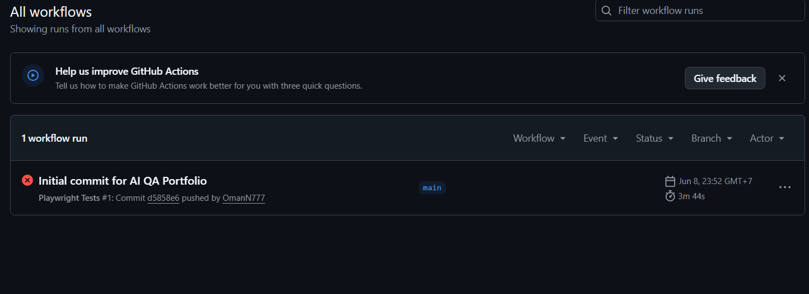
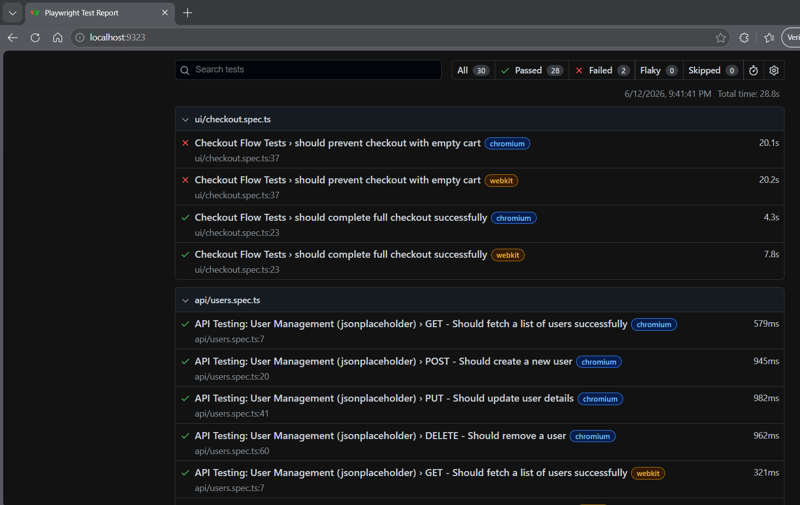
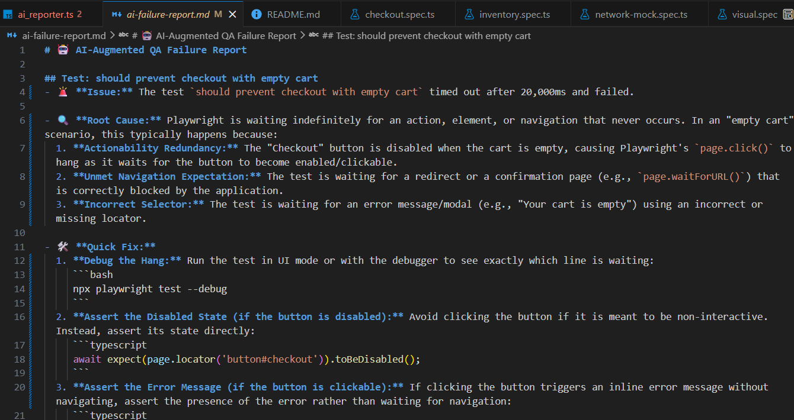

# 🤖 AI-Augmented QA Portfolio

> A Playwright automation framework featuring an **AI-powered failure analysis system** that automatically diagnoses test failures and integrates with GitHub Actions CI/CD.

[](https://github.com/OmanN777/playwright-ai-reporter/actions/workflows/playwright.yml)

---

## 🌟 Key Features

*   **Custom AI Reporter** — Automatically analyzes failed tests using the Gemini AI model and generates a clear, actionable markdown report with Root Cause and Quick Fix suggestions.
*   **API Automation** — CRUD testing (GET, POST, PUT, DELETE) using JSONPlaceholder mock backend.
*   **UI / E2E Automation** — End-to-end user flows (e.g., Checkout) structured via the **Page Object Model (POM)** design pattern.
*   **Network Mocking** — Isolates frontend tests by intercepting network requests and returning mock JSON responses.
*   **Visual Regression Testing** — Automated pixel-perfect comparisons to catch unintended UI changes.
*   **CI/CD Integration** — GitHub Actions pipeline that runs all tests automatically on every push.

---

## 🛠️ Technology Stack

| Tool | Purpose |
|---|---|
| [Playwright](https://playwright.dev/) | Test Automation Framework |
| TypeScript | Test scripting language |
| [Google Gemini AI](https://ai.google.dev/) | AI Failure Analysis Engine |
| GitHub Actions | CI/CD Pipeline |

---

## 📸 Screenshots

### GitHub Actions CI/CD Pipeline

> The CI/CD pipeline automatically triggers on every push to `main`, running the full test suite in the cloud.

### Playwright HTML Test Report

> A full run of 30 test cases across UI, API, Visual Regression, and Network Mocking suites, executed on both **Chromium** and **WebKit** browsers.

### AI-Generated Failure Report

> When a test fails, the custom AI Reporter sends the error stack trace to Gemini, which responds with a structured analysis including the **Root Cause** and a **Quick Fix** with code examples.

---

## 🚀 Getting Started

### 1. Prerequisites
- Node.js (v18 or higher)

### 2. Installation
```bash
# Install NPM dependencies
npm install

# Install Playwright browsers
npx playwright install chromium webkit --with-deps
```

### 3. Environment Setup
Create a `.env` file in the root directory:
```env
GEMINI_API_KEY=your_gemini_api_key_here
```

---

## 🧪 Running Tests

```bash
# Run all tests
npx playwright test

# Run only API tests
npx playwright test tests/api/

# Run only UI tests
npx playwright test tests/ui/

# View the HTML report
npx playwright show-report
```

---

## 🧠 How the AI Reporter Works

```
Test Fails
    ↓
ai_reporter.ts intercepts the failure & error stack trace
    ↓
Sends error context to Gemini AI API
    ↓
Gemini returns: Root Cause + Quick Fix + Code Example
    ↓
Saved to ai-failure-report.md
    ↓
(On CI) GitHub Actions attaches report to the Pull Request as a comment
```

---

*Created by [OmanN777](https://github.com/OmanN777)*

